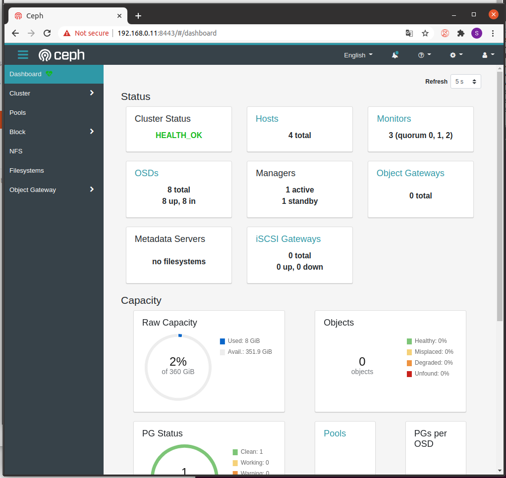

# Ceph-octopus Labs
Matériel pour commencer à jouer avec Ceph. Ce labs virtuelle Vagrant contient un environnement pour faire l'installation de Ceph octopus en quelque étapes. 
## Installation de vagrant et libvirt sur votre poste Ubuntu
```
sudo apt-get install virt-manager
sudo apt install vagrant
```
## Clone ceph-octopus labs
```
git clone https://github.com/sg4r/ceph-octopus.git
cd ceph-octopus
```
## Start labs
```
#start all Vms 
vagrant up
#status des Vms
vagrant status
```
## Préparation de la configuration des nodes du cluster Ceph.
```
#connexion au premier node
vagrant ssh cn1
#configuration de tous les nodes Ceph
[vagrant@cn1 ~]$ for i in {1..4}; do ssh root@cn$i dnf install -y podman; done
[vagrant@cn1 ~]$ for i in {1..4}; do ssh root@cn$i systemctl stop firewalld.service; done
[vagrant@cn1 ~]$ for i in {1..4}; do ssh root@cn$i systemctl disable firewalld.service; done
```
## Installtion du clusteur Ceph avec cephadm
```
[vagrant@cn1 ~]$ curl --silent --remote-name --location https://github.com/ceph/ceph/raw/octopus/src/cephadm/cephadm
[vagrant@cn1 ~]$ chmod +x cephadm
[vagrant@cn1 ~]$ sudo mkdir -p /etc/ceph
[vagrant@cn1 ~]$ sudo ./cephadm bootstrap --mon-ip 192.168.0.11
Verifying podman|docker is present...
Verifying lvm2 is present...
Verifying time synchronization is in place...
Unit chronyd.service is enabled and running
Repeating the final host check...
podman|docker (/bin/podman) is present
systemctl is present
lvcreate is present
Unit chronyd.service is enabled and running
Host looks OK
Cluster fsid: c9eacd34-513d-11eb-9233-5254009e5678
Verifying IP 192.168.0.11 port 3300 ...
Verifying IP 192.168.0.11 port 6789 ...
Mon IP 192.168.0.11 is in CIDR network 192.168.0.0/24
Pulling container image docker.io/ceph/ceph:v15...
Extracting ceph user uid/gid from container image...
Creating initial keys...
Creating initial monmap...
Creating mon...
Waiting for mon to start...
Waiting for mon...
mon is available
Assimilating anything we can from ceph.conf...
Generating new minimal ceph.conf...
Restarting the monitor...
Setting mon public_network...
Creating mgr...
Verifying port 9283 ...
Wrote keyring to /etc/ceph/ceph.client.admin.keyring
Wrote config to /etc/ceph/ceph.conf
Waiting for mgr to start...
Waiting for mgr...
mgr not available, waiting (1/10)...
mgr not available, waiting (2/10)...
mgr not available, waiting (3/10)...
mgr not available, waiting (4/10)...
mgr is available
Enabling cephadm module...
Waiting for the mgr to restart...
Waiting for Mgr epoch 5...
Mgr epoch 5 is available
Setting orchestrator backend to cephadm...
Generating ssh key...
Wrote public SSH key to to /etc/ceph/ceph.pub
Adding key to root@localhost's authorized_keys...
Adding host cn1...
Deploying mon service with default placement...
Deploying mgr service with default placement...
Deploying crash service with default placement...
Enabling mgr prometheus module...
Deploying prometheus service with default placement...
Deploying grafana service with default placement...
Deploying node-exporter service with default placement...
Deploying alertmanager service with default placement...
Enabling the dashboard module...
Waiting for the mgr to restart...
Waiting for Mgr epoch 13...
Mgr epoch 13 is available
Generating a dashboard self-signed certificate...
Creating initial admin user...
Fetching dashboard port number...
Ceph Dashboard is now available at:

	     URL: https://cn1:8443/
	    User: admin
	Password: 8h7vq65npa

You can access the Ceph CLI with:

	sudo ./cephadm shell --fsid c9eacd34-513d-11eb-9233-5254009e5678 -c /etc/ceph/ceph.conf -k /etc/ceph/ceph.client.admin.keyring

Please consider enabling telemetry to help improve Ceph:

	ceph telemetry on

For more information see:

	https://docs.ceph.com/docs/master/mgr/telemetry/

Bootstrap complete.

#Add ssh key
[vagrant@cn1 ~]$ ssh-copy-id -f -i /etc/ceph/ceph.pub root@cn2
/usr/bin/ssh-copy-id: INFO: Source of key(s) to be installed: "/etc/ceph/ceph.pub"

Number of key(s) added: 1

Now try logging into the machine, with:   "ssh 'root@cn2'"
and check to make sure that only the key(s) you wanted were added.
[vagrant@cn1 ~]$ ssh-copy-id -f -i /etc/ceph/ceph.pub root@cn3
/usr/bin/ssh-copy-id: INFO: Source of key(s) to be installed: "/etc/ceph/ceph.pub"

Number of key(s) added: 1

Now try logging into the machine, with:   "ssh 'root@cn3'"
and check to make sure that only the key(s) you wanted were added.
[vagrant@cn1 ~]$ ssh-copy-id -f -i /etc/ceph/ceph.pub root@cn4
/usr/bin/ssh-copy-id: INFO: Source of key(s) to be installed: "/etc/ceph/ceph.pub"

Number of key(s) added: 1

Now try logging into the machine, with:   "ssh 'root@cn4'"
and check to make sure that only the key(s) you wanted were added.

# connexion au cluster ceph
[vagrant@cn1 ~]$ sudo ./cephadm shell 
Using recent ceph image docker.io/ceph/ceph:v15
# Remarque  : on passe dans le contenaire. Attention au changement de shell en [ceph: root@cn1 /]
[ceph: root@cn1 /]# ceph -s
  cluster:
    id:     c9eacd34-513d-11eb-9233-5254009e5678
    health: HEALTH_WARN
            OSD count 0 < osd_pool_default_size 3
 
  services:
    mon: 1 daemons, quorum cn1 (age 2m)
    mgr: cn1.erhuht(active, since 96s)
    osd: 0 osds: 0 up, 0 in
 
  data:
    pools:   0 pools, 0 pgs
    objects: 0 objects, 0 B
    usage:   0 B used, 0 B / 0 B avail
    pgs:     
# Remarque : Le clusteur est en warring au début, car il n'y a pas encore d'osd ou plusieurs mon, mais on va règler cela rapidement
# Ajouter les nodes supplémentaire au cluster Ceph

# liste des nodes dans le clusteur. On retrouve bien les 4 nodes
[ceph: root@cn1 /]# ceph orch host ls
HOST  ADDR  LABELS  STATUS  
cn1   cn1                   
cn2   cn2                   
cn3   cn3                   
cn4   cn4                   

# l'ajout des nodes va augmenter automatiquement le nombre de process dans le clusteur.
[ceph: root@cn1 /]# ceph orch ls
NAME           RUNNING  REFRESHED  AGE  PLACEMENT  IMAGE NAME                            IMAGE ID      
alertmanager       1/1  2m ago     10m  count:1    docker.io/prom/alertmanager:v0.20.0   0881eb8f169f  
crash              2/4  2m ago     10m  *          docker.io/ceph/ceph:v15               5553b0cb212c  
grafana            1/1  2m ago     10m  count:1    docker.io/ceph/ceph-grafana:6.6.2     a0dce381714a  
mgr                2/2  2m ago     10m  count:2    docker.io/ceph/ceph:v15               5553b0cb212c  
mon                1/5  2m ago     10m  count:5    docker.io/ceph/ceph:v15               5553b0cb212c  
node-exporter      2/4  2m ago     10m  *          docker.io/prom/node-exporter:v0.18.1  e5a616e4b9cf  
prometheus         1/1  2m ago     10m  count:1    docker.io/prom/prometheus:v2.18.1     de242295e225  

# au bout de 3 minutes, on retrouve bien 4/4 service crash, 3/5 mon, 4/4 node-exporter 
[ceph: root@cn1 /]# ceph orch ls
NAME           RUNNING  REFRESHED  AGE  PLACEMENT  IMAGE NAME                            IMAGE ID      
alertmanager       1/1  -          12m  count:1    <unknown>                             <unknown>     
crash              4/4  13s ago    12m  *          mix                                   mix           
grafana            1/1  10s ago    12m  count:1    docker.io/ceph/ceph-grafana:6.6.2     a0dce381714a  
mgr                2/2  12s ago    12m  count:2    mix                                   mix           
mon                3/5  12s ago    12m  count:5    mix                                   mix           
node-exporter      4/4  13s ago    12m  *          docker.io/prom/node-exporter:v0.18.1  e5a616e4b9cf  
prometheus         1/1  -          12m  count:1    <unknown>                             <unknown>     

# le clusteur Ceph est toujours en warring, mais il a maintenant 3 moniteurs et 2 mgr
[ceph: root@cn1 /]# ceph -s
  cluster:
    id:     c9eacd34-513d-11eb-9233-5254009e5678
    health: HEALTH_WARN
            OSD count 0 < osd_pool_default_size 3
 
  services:
    mon: 3 daemons, quorum cn1,cn2,cn4 (age 2m)
    mgr: cn1.erhuht(active, since 13m), standbys: cn2.jnqrhu
    osd: 0 osds: 0 up, 0 in
 
  data:
    pools:   0 pools, 0 pgs
    objects: 0 objects, 0 B
    usage:   0 B used, 0 B / 0 B avail
    pgs:
         
# ajoutons des disques au clusteur, mais avant cela on peux lister l'ensemble des disques libres éxistant
[ceph: root@cn1 /]# ceph orch device ls
Hostname  Path      Type  Serial  Size   Health   Ident  Fault  Available  
cn1       /dev/vdb  hdd           42.9G  Unknown  N/A    N/A    Yes        
cn1       /dev/vdc  hdd           53.6G  Unknown  N/A    N/A    Yes        
cn2       /dev/vdb  hdd           42.9G  Unknown  N/A    N/A    Yes        
cn2       /dev/vdc  hdd           53.6G  Unknown  N/A    N/A    Yes        
cn3       /dev/vdb  hdd           42.9G  Unknown  N/A    N/A    Yes        
cn3       /dev/vdc  hdd           53.6G  Unknown  N/A    N/A    Yes        
cn4       /dev/vdb  hdd           42.9G  Unknown  N/A    N/A    Yes        
cn4       /dev/vdc  hdd           53.6G  Unknown  N/A    N/A    Yes        

# une commande pour ajouter tous les disques libres, c'est pratique ;)
[ceph: root@cn1 /]# ceph orch apply osd --all-available-devices
Scheduled osd.all-available-devices update...

# vérification des disques utilisé par le clusteur
[ceph: root@cn1 /]# ceph osd df
ID  CLASS  WEIGHT   REWEIGHT  SIZE     RAW USE  DATA     OMAP  META   AVAIL    %USE  VAR   PGS  STATUS
 3    hdd  0.03909   1.00000   40 GiB  1.0 GiB    3 MiB   0 B  1 GiB   39 GiB  2.51  1.13    0      up
 7    hdd  0.04880   1.00000   50 GiB  1.0 GiB    3 MiB   0 B  1 GiB   49 GiB  2.01  0.90    1      up
 2    hdd  0.03909   1.00000   40 GiB  1.0 GiB    3 MiB   0 B  1 GiB   39 GiB  2.51  1.13    1      up
 6    hdd  0.04880   1.00000   50 GiB  1.0 GiB    3 MiB   0 B  1 GiB   49 GiB  2.01  0.90    0      up
 1    hdd  0.03909   1.00000   40 GiB  1.0 GiB    3 MiB   0 B  1 GiB   39 GiB  2.51  1.13    0      up
 5    hdd  0.04880   1.00000   50 GiB  1.0 GiB    3 MiB   0 B  1 GiB   49 GiB  2.01  0.90    0      up
 0    hdd  0.03909   1.00000   40 GiB  1.0 GiB  2.9 MiB   0 B  1 GiB   39 GiB  2.51  1.12    1      up
 4    hdd  0.04880   1.00000   50 GiB  1.0 GiB    3 MiB   0 B  1 GiB   49 GiB  2.01  0.90    0      up
                       TOTAL  360 GiB  8.0 GiB   24 MiB   0 B  8 GiB  352 GiB  2.23                   
MIN/MAX VAR: 0.90/1.13  STDDEV: 0.25
# vérifiont le status du cluster. c'est ok, on a bien 8 osds dans le cluster avec 4 nodes.
[ceph: root@cn1 /]# ceph -s
  cluster:
    id:     c9eacd34-513d-11eb-9233-5254009e5678
    health: HEALTH_OK
 
  services:
    mon: 3 daemons, quorum cn1,cn2,cn4 (age 4m)
    mgr: cn1.erhuht(active, since 16m), standbys: cn2.jnqrhu
    osd: 8 osds: 8 up (since 19s), 8 in (since 19s)
 
  task status:
 
  data:
    pools:   1 pools, 1 pgs
    objects: 0 objects, 0 B
    usage:   8.0 GiB used, 352 GiB / 360 GiB avail
    pgs:     1 active+clean

```
## connexion au dashbord du cluster Ceph
retrouvez vos informations de connexoins fournit lors de l'initialisation du cluster , et utilisez un navigateur pour vous connecter a l'adresse https://192.168.0.11:8443
saisir le compte admin et le mot de passe associer. il faudra changer le mot de passe par defaut a la premiere connexion.
Voici une copie d'ecran du dashboard de ceph octopus



