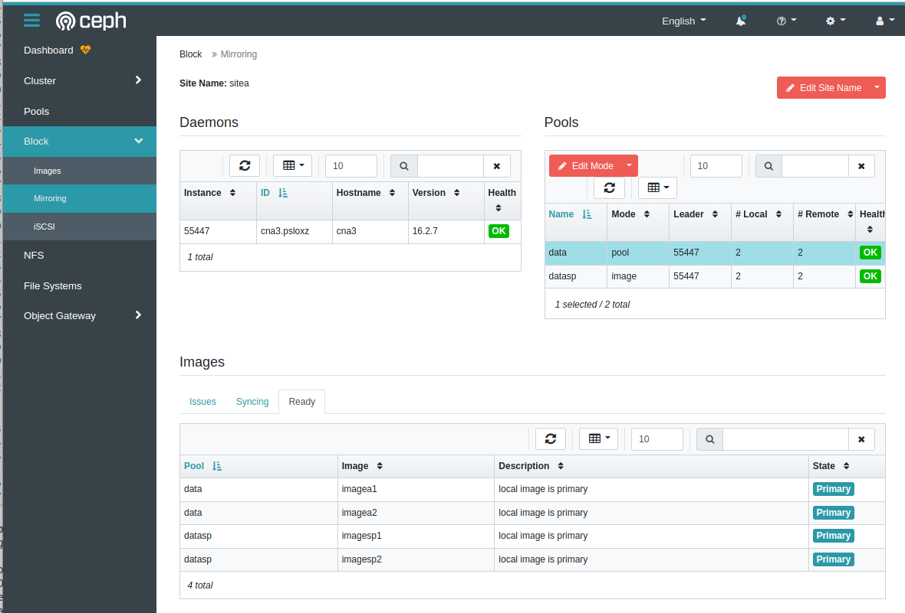
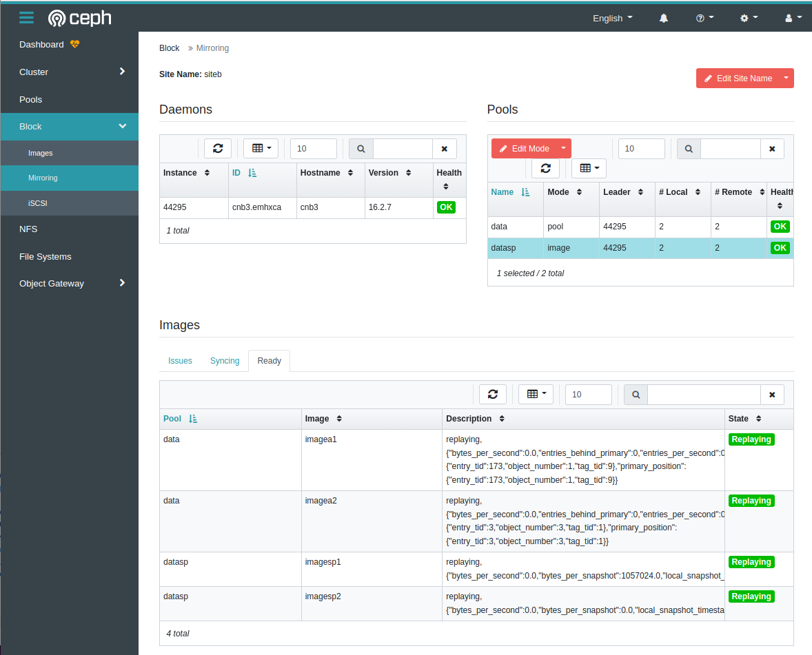

# Ceph mirroring
Un cluster Ceph distribue sont stockage sur différents serveurs en mode synchrone limitant ainsi les distances entre chaque serveur. C'est pourquoi la mise en place d'un cluster étendu sur de longues distances n'est pas une bonne idée car cela augmente les latences et dégrade les performances.
Pour garantir une disponibilité des données, il est possible de faire de la réplication asynchrone entre deux clusters Ceph distant de plusieurs centaines de kilomètres.  

**Avantage :**  
- _Plan de reprise d’activité_ : un site de secours peut reprendre l'activité rapidement. Le site dispose d'une copie des données et il n'est pas nécessaire d'avoir la même infrastructure ou la même version de Ceph au niveau des 2 clusters. Chaque cluster peut évoluer à son rythme.  
- _Haute disponibilité_ : Avec 2 clusters Ceph distant, il est possible que chacun réplique les données et ce qui permet des clients par zones.  

Il y a un type de réplication en fonction du type de stockage :  

**[rbd-mirroring](https://docs.ceph.com/en/latest/rbd/rbd-mirroring/)** est disponible en deux modes :
Mode basé sur un _journal_ : Ce mode utilise la fonctionnalité de journalisation de l'image RBD afin de garantir une réplication. Les modifications sont appliquées en continue par relecture du journal sur le site distant. Il est possible de choisir de répliquer tout un pool ou une série d’image rbd d’un pool.  
Mode basé sur _snapschot_ : Ce mode utilise des snapshots d'image RBD planifiés régulièrement pour répliquer des images RBD. En fonction de l’intervalle, les modifications ne sont pas présentées sur le site secondaire s’il y a un désastre sur le site primaire.  

Selon les besoins de réplication, la mise en miroir RBD peut être configurée pour une réplication unidirectionnelle ou bidirectionnelle :  
Réplication unidirectionnelle : Lorsque les données sont mises en miroir uniquement à partir du cluster primaire vers le cluster secondaire  
Réplication bidirectionnelle : Lorsque les données sont mises en miroir à partir des images primaires d’un cluster vers le cluster secondaire et inversement. 
Il n’est possible que de réaliser une réplication par sélection d’une série image RBD depuis un ou plusieurs pools.

**[cephfs-mirroring](https://docs.ceph.com/en/latest/dev/cephfs-mirroring/)** : réplication des données CephFS. Disponible depuis la version Ceph Pacific.   
 Fonctionne seulement vers un site de secours avec la possibilité de faire un plan de reprise d'activité. Il possible de sélectionner différents répertoires avec une définition de différents règles de snapshots.

**[radosgw-multisites](https://docs.ceph.com/en/latest/radosgw/multisite-sync-policy/)** : à compléter.

# Environement 
Pour tester ces fonctions, il est nécessaire de disposer de 2 cluster Ceph.  
Le fichier vagrant « cephmirror » est disponible dans le dossier le dossier. Avant de l’utiliser détruisez votre environnement actuel avec la commande vagrant halt et vagrant destoy. Puis remplacer le fichier Vagrant avec l'environement cephenvmirror qui contient la définition de 2 clusters.  
Le cluster A avec les nodes cna1,2,3 et le cluster B avec les nodes cnb1,2,3  et un serveur cephclt  qui serra le client pour accéder à ces 2 cluster Ceph A,B.

```
# arrêt et suppression de l'environement vfcephenvstart
vagrant halt
vagrant destroy
# remplacement de l'environement
mv Vagrantfile vfcephenvstart
mv vfcephenvmirror Vagrantfile
```

## Création des 2 clusters A et B
```
# connexion au premier cluster A
vagrant ssh cna1
# configuration de tous les nodes Ceph
[vagrant@cna1 ~]$ for i in {1..3}; do ssh root@cna$i dnf install -y podman lvm2; done
[vagrant@cna1 ~]$ for i in {1..3}; do ssh root@cna$i systemctl stop firewalld.service; done
[vagrant@cna1 ~]$ for i in {1..3}; do ssh root@cna$i systemctl disable firewalld.service; done
[vagrant@cna1 ~]$ sudo yum -y install https://download.ceph.com/rpm-16.2.7/el8/noarch/cephadm-16.2.7-0.el8.noarch.rpm
[vagrant@cna1 ~]$ sudo cephadm bootstrap --mon-ip 192.168.111.11 --skip-monitoring-stack
 	     URL: https://cna1:8443/
	     User: admin
	Password: 039ovs9fjy => passsitea
 #noter le pass par defaut pour le changer ensuite en passsitea

[vagrant@cna1 ~]$ for i in {2..3}; do ssh-copy-id -f -i /etc/ceph/ceph.pub root@cna$i; done
[vagrant@cna1 ~]$ for i in {2..3}; do ssh root@cna$i dnf -y install https://download.ceph.com/rpm-16.2.7/el8/noarch/cephadm-16.2.7-0.el8.noarch.rpm; done
[vagrant@cna1 ~]$ sudo cephadm shell
#depuis le shell du conteneur 
ceph orch host add cna2
ceph orch host add cna3
ceph orch host ls
ceph orch ls
ceph orch device ls
#attendre que les nodes soient dans le cluster
ceph orch apply osd --all-available-devices
ceph osd tree


# connexion au deuxième cluster B
vagrant ssh cnb1
# configuration de tous les nodes Ceph
[vagrant@cnb1 ~]$ for i in {1..3}; do ssh root@cnb$i dnf install -y podman lvm2; done
[vagrant@cnb1 ~]$ for i in {1..3}; do ssh root@cnb$i systemctl stop firewalld.service; done
[vagrant@cnb1 ~]$ for i in {1..3}; do ssh root@cnb$i systemctl disable firewalld.service; done
[vagrant@cnb1 ~]$ sudo yum -y install https://download.ceph.com/rpm-16.2.7/el8/noarch/cephadm-16.2.7-0.el8.noarch.rpm
[vagrant@cnb1 ~]$ sudo cephadm bootstrap --mon-ip 192.168.111.20 --skip-monitoring-stack
 	     URL: https://cnb1:8443/
	     User: admin
	Password: 2f4dq012jk  => passsiteb
 #noter le pass par defaut pour le changer ensuite en passsiteb

[vagrant@cnb1 ~]$ for i in {2..3}; do ssh-copy-id -f -i /etc/ceph/ceph.pub root@cnb$i; done
[vagrant@cnb1 ~]$ for i in {2..3}; do ssh root@cna$i dnf -y install https://download.ceph.com/rpm-16.2.7/el8/noarch/cephadm-16.2.7-0.el8.noarch.rpm; done
[vagrant@cnb1 ~]$ sudo cephadm shell
#depuis le shell du conteneur 
ceph orch host add cnb2
ceph orch host add cnb3
ceph orch host ls
ceph orch ls
ceph orch device ls
#attendre que les nodes soient dans le cluster
ceph orch apply osd --all-available-devices
ceph osd tree


# connexion a cephclt
vagrant ssh cephclt
```
# rbd-mirroring
TP pour la configuration du mode two-way rbd mirroring avec un journal sur le pool data et en mode snapshot sur le pool datasp en mode image.
la configuration est réalisé avec les commandes en ligne.
pour l'utilisation de la partie graphique consulter la [documentation de suse](https://documentation.suse.com/fr-fr/ses/7/html/ses-all/dashboard-rbds.html#id-1.4.3.7.11.11.5.3.2)
```

[ceph: root@cna1 /]# ceph osd pool create data 16   
pool 'data' created
[ceph: root@cna1 /]# ceph osd pool application enable data rbd
enabled application 'rbd' on pool 'data'
[ceph: root@cna1 /]# rbd create imagea1 --size 1024 --pool data --image-feature exclusive-lock,journaling
[ceph: root@cna1 /]# rbd mirror pool enable data pool
[ceph: root@cna1 /]# rbd mirror pool info  data
Mode: pool
Site Name: 4568919c-c2f5-11ec-9de9-5254004f5434

Peer Sites: none

[ceph: root@cnb1 /]# ceph orch apply rbd-mirror --placement=cnb3
Scheduled rbd-mirror update...
[ceph: root@cnb1 /]# ceph osd pool create data 16   
pool 'data' created
[ceph: root@cnb1 /]# ceph osd pool application enable data rbd
enabled application 'rbd' on pool 'data'
[ceph: root@cnb1 /]# rbd mirror pool enable data pool
[ceph: root@cnb1 /]# rbd mirror pool info  dataMode: pool
Site Name: 13778d70-c2f8-11ec-915d-525400a57d8a

Peer Sites: none


[ceph: root@cna1 /]# rbd mirror pool peer bootstrap create --site-name sitea data > token_sitea
[ceph: root@cna1 /]# cat token_sitea
eyJmc2lkIjoiNDU2ODkxOWMtYzJmNS0xMWVjLTlkZTktNTI1NDAwNGY1NDM0IiwiY2xpZW50X2lkIjoicmJkLW1pcnJvci1wZWVyIiwia2V5IjoiQVFEVTFXMWlLK0tZTEJBQVhCeE0rZUQ1UHhEcS9IMDA4VjZVVnc9PSIsIm1vbl9ob3N0IjoiW3YyOjE5Mi4xNjguMTExLjExOjMzMDAvMCx2MToxOTIuMTY4LjExMS4xMTo2Nzg5LzBdIFt2MjoxOTIuMTY4LjExMS4xMjozMzAwLzAsdjE6MTkyLjE2OC4xMTEuMTI6Njc4OS8wXSBbdjI6MTkyLjE2OC4xMTEuMTM6MzMwMC8wLHYxOjE5Mi4xNjguMTExLjEzOjY3ODkvMF0ifQ==


[ceph: root@cnb1 /]# echo eyJmc2lkIjoiNDU2ODkxOWMtYzJmNS0xMWVjLTlkZTktNTI1NDAwNGY1NDM0IiwiY2xpZW50X2lkIjoicmJkLW1pcnJvci1wZWVyIiwia2V5IjoiQVFEVTFXMWlLK0tZTEJBQVhCeE0rZUQ1UHhEcS9IMDA4VjZVVnc9PSIsIm1vbl9ob3N0IjoiW3YyOjE5Mi4xNjguMTExLjExOjMzMDAvMCx2MToxOTIuMTY4LjExMS4xMTo2Nzg5LzBdIFt2MjoxOTIuMTY4LjExMS4xMjozMzAwLzAsdjE6MTkyLjE2OC4xMTEuMTI6Njc4OS8wXSBbdjI6MTkyLjE2OC4xMTEuMTM6MzMwMC8wLHYxOjE5Mi4xNjguMTExLjEzOjY3ODkvMF0ifQ== >token_sitea
[ceph: root@cnb1 /]# cat token_sitea |base64 -d |jq -r .key >sitea.keyfile
[ceph: root@cnb1 /]# remote_monsitea=$(cat token_sitea |base64 -d |jq -r .mon_host)
[ceph: root@cnb1 /]# rbd mirror pool peer add data client.rbd-mirror-peer@sitea --remote-mon-host "$remote_monsitea" --remote-key-file sitea.keyfile --direction rx-tx
1dc1a0e3-5f97-4e44-a535-37ab43bad7eb
[ceph: root@cnb1 /]# rbd mirror pool info  data
Mode: pool
Site Name: 13778d70-c2f8-11ec-915d-525400a57d8a

Peer Sites: 

UUID: 1dc1a0e3-5f97-4e44-a535-37ab43bad7eb
Name: sitea
Mirror UUID: 
Direction: rx-tx
Client: client.rbd-mirror-peer

[ceph: root@cnb1 /]# rbd mirror pool peer bootstrap create --site-name siteb data > token_siteb
[ceph: root@cnb1 /]# cat token_siteb
eyJmc2lkIjoiMTM3NzhkNzAtYzJmOC0xMWVjLTkxNWQtNTI1NDAwYTU3ZDhhIiwiY2xpZW50X2lkIjoicmJkLW1pcnJvci1wZWVyIiwia2V5IjoiQVFETjJXMWlla0V2RXhBQTNvRHNTN2p5S2lYL1R4RnpnazN3WUE9PSIsIm1vbl9ob3N0IjoiW3YyOjE5Mi4xNjguMTExLjIwOjMzMDAvMCx2MToxOTIuMTY4LjExMS4yMDo2Nzg5LzBdIFt2MjoxOTIuMTY4LjExMS4yMTozMzAwLzAsdjE6MTkyLjE2OC4xMTEuMjE6Njc4OS8wXSBbdjI6MTkyLjE2OC4xMTEuMjI6MzMwMC8wLHYxOjE5Mi4xNjguMTExLjIyOjY3ODkvMF0ifQ==

[ceph: root@cna1 /]# echo eyJmc2lkIjoiMTM3NzhkNzAtYzJmOC0xMWVjLTkxNWQtNTI1NDAwYTU3ZDhhIiwiY2xpZW50X2lkIjoicmJkLW1pcnJvci1wZWVyIiwia2V5IjoiQVFETjJXMWlla0V2RXhBQTNvRHNTN2p5S2lYL1R4RnpnazN3WUE9PSIsIm1vbl9ob3N0IjoiW3YyOjE5Mi4xNjguMTExLjIwOjMzMDAvMCx2MToxOTIuMTY4LjExMS4yMDo2Nzg5LzBdIFt2MjoxOTIuMTY4LjExMS4yMTozMzAwLzAsdjE6MTkyLjE2OC4xMTEuMjE6Njc4OS8wXSBbdjI6MTkyLjE2OC4xMTEuMjI6MzMwMC8wLHYxOjE5Mi4xNjguMTExLjIyOjY3ODkvMF0ifQ== >token_siteb

[ceph: root@cna1 /]# ceph orch apply rbd-mirror --placement=cna3
Scheduled rbd-mirror update...
[ceph: root@cna1 /]# cat token_siteb |base64 -d |jq -r .key >siteb.keyfile
[ceph: root@cna1 /]# remote_monsiteb=$(cat token_siteb |base64 -d |jq -r .mon_host)
[ceph: root@cna1 /]# rbd mirror pool peer add data client.rbd-mirror-peer@siteb --remote-mon-host "$remote_monsiteb" --remote-key-file siteb.keyfile --direction rx-tx
f686c18f-412a-4864-a4fa-bd812b0714ef
[ceph: root@cna1 /]#  rbd mirror pool info  data
Mode: pool
Site Name: sitea

Peer Sites: 

UUID: f686c18f-412a-4864-a4fa-bd812b0714ef
Name: siteb
Mirror UUID: 
Direction: rx-tx
Client: client.rbd-mirror-peer


[ceph: root@cna1 /]# rbd  mirror pool status data   
health: OK
daemon health: OK
image health: OK
images: 1 total
    1 replaying


# ok la réplication est activé.
# partie cephclt pour consommer les ressources

[root@cephclt ~]# sudo yum -y install centos-release-ceph-pacific.noarch
[root@cephclt ~]# sudo yum -y install ceph-common
[root@cephclt ~]# sudo yum -y install rbd-nbd

[vagrant@cna1 ~]$ sudo cephadm shell cat /etc/ceph/ceph.conf >sitea.conf
[vagrant@cna1 ~]$ sudo cephadm shell ceph auth get client.rbd-mirror-peer >sitea.client.rbd-mirror-peer.keyring
exported keyring for client.rbd-mirror-peer
[vagrant@cna1 ~]$ scp sitea* root@cephclt:/etc/ceph
sitea.client.rbd-mirror-peer.keyring                                                       100%  137   138.5KB/s   00:00    
sitea.conf                                                                                 100%  283   221.0KB/s   00:00    
[vagrant@cna1 ~]$ 

vagrant@cnb1 ~]$ sudo cephadm shell cat /etc/ceph/ceph.conf >siteb.conf
[vagrant@cnb1 ~]$ sudo cephadm shell ceph auth get client.rbd-mirror-peer >siteb.client.rbd-mirror-peer.keyring
exported keyring for client.rbd-mirror-peer
[vagrant@cnb1 ~]$ scp siteb* root@cephclt:/etc/ceph
siteb.client.rbd-mirror-peer.keyring                                                   100%  137   157.8KB/s   00:00    
siteb.conf                                                                             100%  283   419.3KB/s   00:00    
[vagrant@cnb1 ~]$ 

# vérification qui est primaire ?
[vagrant@cephclt ~]$ rbd --cluster sitea --id rbd-mirror-peer info data/imagea1 |grep primary
	mirroring primary: true
[vagrant@cephclt ~]$ rbd --cluster siteb --id rbd-mirror-peer info data/imagea1 |grep primary
	mirroring primary: false

# sitea est bien primaire

[root@cephclt ~]# rbd-nbd --cluster sitea --id rbd-mirror-peer map data/imagea1
/dev/nbd0
[root@cephclt ~]# mkfs.xfs /dev/nbd0
Discarding blocks...Done.
[root@cephclt ~]# mkdir /work
[root@cephclt ~]# mount /dev/nbd0 /work
[root@cephclt ~]# echo "depuis sitea" > /work/prod.txt
[root@cephclt ~]# umount /work/
[root@cephclt ~]# rbd-nbd unmap /dev/nbd0

[root@cephclt ~]# rbd --cluster sitea --id rbd-mirror-peer mirror pool demote data
Demoted 1 mirrored images
[root@cephclt ~]# rbd --cluster siteb --id rbd-mirror-peer mirror pool promote data
Promoted 1 mirrored images
[root@cephclt ~]# rbd --cluster sitea --id rbd-mirror-peer info data/imagea1 |grep primary
	mirroring primary: false
[root@cephclt ~]# rbd --cluster siteb --id rbd-mirror-peer info data/imagea1 |grep primary
	mirroring primary: true
[root@cephclt ~]# rbd-nbd --cluster siteb --id rbd-mirror-peer map data/imagea1
/dev/nbd0
[root@cephclt ~]# mount /dev/nbd0 /work
[root@cephclt ~]# cat /work/prod.txt 
depuis sitea
[root@cephclt ~]# echo "PRA depuis siteb" >>/work/prod.txt
[root@cephclt ~]# cat /work/prod.txt 
depuis sitea
PRA depuis siteb
[root@cephclt ~]# umount /work
[root@cephclt ~]# rbd-nbd unmap /dev/nbd0

[root@cephclt ~]# rbd --cluster siteb --id rbd-mirror-peer mirror pool demote data
Demoted 1 mirrored images
[root@cephclt ~]# rbd --cluster sitea --id rbd-mirror-peer mirror pool promote data
Promoted 1 mirrored images
[root@cephclt ~]# rbd --cluster sitea --id rbd-mirror-peer info data/imagea1 |grep primary
	mirroring primary: true
[root@cephclt ~]# rbd-nbd --cluster sitea --id rbd-mirror-peer map data/imagea1
/dev/nbd0
[root@cephclt ~]# mount /dev/nbd0 /work
[root@cephclt ~]# cat /work/prod.txt 
depuis sitea
PRA depuis siteb
[root@cephclt ~]# echo "retour prod sitea" >>/work/prod.txt 
[
# passage au siteb primaire puis rebasculement vers le sitea, ca fonctionne
# ajouter une nouvelle image dans le pool et verifier quelle soit prise en compte lors du demote et du promote

[ceph: root@cna1 /]# rbd create imagea2 --size 1024 --pool data --image-feature exclusive-lock,journaling


# création une réplication par snap

[ceph: root@cna1 /]# ceph osd pool create datasp 16       
pool 'datasp' created
[ceph: root@cna1 /]# ceph osd pool application enable datasp rbd
enabled application 'rbd' on pool 'datasp'
[ceph: root@cna1 /]# rbd create imagesp1 --size 1024 --pool datasp --image-feature exclusive-lock,object-map,fast-diff
[ceph: root@cna1 /]# rbd mirror pool enable datasp image
[ceph: root@cna1 /]# rbd mirror image enable datasp/imagesp1 snapshot
Mirroring enabled

[ceph: root@cnb1 /]# ceph osd pool create datasp 16       
pool 'datasp' created
[ceph: root@cnb1 /]# ceph osd pool application enable datasp rbd
enabled application 'rbd' on pool 'datasp'
[ceph: root@cnb1 /]# rbd create imagesp2 --size 1024 --pool datasp --image-feature exclusive-lock,object-map,fast-diff

[ceph: root@cnb1 /]# rbd mirror pool enable datasp image
[ceph: root@cnb1 /]# rbd mirror image enable datasp/imagesp2 snapshot
Mirroring enabled
[ceph: root@cnb1 /]# rbd mirror snapshot schedule add --pool datasp 5m

[ceph: root@cnb1 /]# echo eyJmc2lkIjoiNDU2ODkxOWMtYzJmNS0xMWVjLTlkZTktNTI1NDAwNGY1NDM0IiwiY2xpZW50X2lkIjoicmJkLW1pcnJvci1wZWVyIiwia2V5IjoiQVFEVTFXMWlLK0tZTEJBQVhCeE0rZUQ1UHhEcS9IMDA4VjZVVnc9PSIsIm1vbl9ob3N0IjoiW3YyOjE5Mi4xNjguMTExLjExOjMzMDAvMCx2MToxOTIuMTY4LjExMS4xMTo2Nzg5LzBdIFt2MjoxOTIuMTY4LjExMS4xMjozMzAwLzAsdjE6MTkyLjE2OC4xMTEuMTI6Njc4OS8wXSBbdjI6MTkyLjE2OC4xMTEuMTM6MzMwMC8wLHYxOjE5Mi4xNjguMTExLjEzOjY3ODkvMF0ifQ== >token_sitea
[ceph: root@cnb1 /]# cat token_sitea |base64 -d |jq -r .key >sitea.keyfile
[ceph: root@cnb1 /]# remote_monsitea=$(cat token_sitea |base64 -d |jq -r .mon_host)
[ceph: root@cnb1 /]# rbd mirror pool peer add datasp client.rbd-mirror-peer@sitea --remote-mon-host "$remote_monsitea" --remote-key-file sitea.keyfile --direction rx-tx
13751254-a489-49e2-928d-6309e1a4e266

[ceph: root@cna1 /]# echo eyJmc2lkIjoiMTM3NzhkNzAtYzJmOC0xMWVjLTkxNWQtNTI1NDAwYTU3ZDhhIiwiY2xpZW50X2lkIjoicmJkLW1pcnJvci1wZWVyIiwia2V5IjoiQVFETjJXMWlla0V2RXhBQTNvRHNTN2p5S2lYL1R4RnpnazN3WUE9PSIsIm1vbl9ob3N0IjoiW3YyOjE5Mi4xNjguMTExLjIwOjMzMDAvMCx2MToxOTIuMTY4LjExMS4yMDo2Nzg5LzBdIFt2MjoxOTIuMTY4LjExMS4yMTozMzAwLzAsdjE6MTkyLjE2OC4xMTEuMjE6Njc4OS8wXSBbdjI6MTkyLjE2OC4xMTEuMjI6MzMwMC8wLHYxOjE5Mi4xNjguMTExLjIyOjY3ODkvMF0ifQ== >token_siteb
[ceph: root@cna1 /]# cat token_siteb |base64 -d |jq -r .key >siteb.keyfile
[ceph: root@cna1 /]# remote_monsiteb=$(cat token_siteb |base64 -d |jq -r .mon_host)
[ceph: root@cna1 /]# rbd mirror pool peer add datasp client.rbd-mirror-peer@siteb --remote-mon-host "$remote_monsiteb" --remote-key-file siteb.keyfile --direction rx-tx
1d61a95f-5af6-47e5-afba-d7dbf74c9302
[ceph: root@cna1 /]# rbd mirror pool info  datasp
Mode: image
Site Name: sitea

Peer Sites: 

UUID: 1d61a95f-5af6-47e5-afba-d7dbf74c9302
Name: siteb
Mirror UUID: 1c826a26-9f24-40e7-8778-1becb9c0ce75
Direction: rx-tx
Client: client.rbd-mirror-peer
[ceph: root@cna1 /]# rbd mirror snapshot schedule add --pool datasp 5m
[ceph: root@cna1 /]# rbd mirror image enable datasp/imagesp1 snapshot
Mirroring enabled
[ceph: root@cna1 /]# rbd  mirror pool status datasp   
health: OK
daemon health: OK
image health: OK
images: 2 total
    2 replaying

[ceph: root@cna1 /]#  rbd mirror image status datasp/imagesp1
imagesp1:
  global_id:   9e50cadc-b357-4a48-b9f6-0e1165190d66
  state:       up+stopped
  description: local image is primary
  service:     cna3.psloxz on cna3
  last_update: 2022-05-01 02:00:22
  peer_sites:
    name: siteb
    state: up+replaying
    description: replaying, {"bytes_per_second":0.0,"bytes_per_snapshot":0.0,"remote_snapshot_timestamp":1651370401,"replay_state":"idle"}
    last_update: 2022-05-01 02:00:14
  snapshots:
    6 .mirror.primary.9e50cadc-b357-4a48-b9f6-0e1165190d66.aeb73b70-ae07-4db1-9243-f1b5da8d6134 (peer_uuids:[1d61a95f-5af6-47e5-afba-d7dbf74c9302])
    10 .mirror.primary.9e50cadc-b357-4a48-b9f6-0e1165190d66.11d381f0-cbb6-4490-ae23-aac38f268c9b (peer_uuids:[1d61a95f-5af6-47e5-afba-d7dbf74c9302])

[ceph: root@cna1 /]#  rbd  info datasp/imagesp1
rbd image 'imagesp1':
	size 1 GiB in 256 objects
	order 22 (4 MiB objects)
	snapshot_count: 2
	id: aeadaed1be90
	block_name_prefix: rbd_data.aeadaed1be90
	format: 2
	features: exclusive-lock, object-map, fast-diff
	op_features: 
	flags: 
	create_timestamp: Sun May  1 01:33:56 2022
	access_timestamp: Sun May  1 01:33:56 2022
	modify_timestamp: Sun May  1 01:33:56 2022
	mirroring state: enabled
	mirroring mode: snapshot
	mirroring global id: 9e50cadc-b357-4a48-b9f6-0e1165190d66
	mirroring primary: true
[ceph: root@cna1 /]# 

# datasp/imagesp1 est primaire sur sitea


[root@cephclt ~]# rbd --cluster sitea --id rbd-mirror-peer info datasp/imagesp1 |grep primary
	mirroring primary: true
[root@cephclt ~]# rbd --cluster sitea --id rbd-mirror-peer info datasp/imagesp2 |grep primary
	features: exclusive-lock, object-map, fast-diff, non-primary
	mirroring primary: false
	
[root@cephclt ~]# rbd --cluster sitea --id rbd-mirror-peer device map  datasp/imagesp1 
/dev/rbd0
[root@cephclt ~]# mkfs.xfs /dev/rbd0
Discarding blocks...Done.
[root@cephclt ~]# mount /dev/rbd0 /work
[root@cephclt ~]# echo sitea prod > /work/prod
[root@cephclt ~]# umount /work


[root@cephclt ~]# rbd --cluster sitea --id rbd-mirror-peer device unmap  /dev/rbd0
[root@cephclt ~]# rbd --cluster sitea --id rbd-mirror-peer mirror image demote datasp/imagesp1
Image demoted to non-primary
[root@cephclt ~]# rbd --cluster siteb --id rbd-mirror-peer mirror image promote datasp/imagesp1
Image promoted to primary
[root@cephclt ~]# rbd --cluster siteb --id rbd-mirror-peer device map datasp/imagesp1
/dev/rbd0
[root@cephclt ~]# mount /dev/rbd0 /work
[root@cephclt ~]# cat /work/prod 
sitea prod
[root@cephclt ~]# echo siteb prod >>/work/prod 
[root@cephclt ~]# umount /work
[root@cephclt ~]# rbd --cluster siteb --id rbd-mirror-peer device unmap /dev/rbd0
[root@cephclt ~]# rbd --cluster siteb --id rbd-mirror-peer mirror image demote datasp/imagesp1
Image demoted to non-primary
[root@cephclt ~]# rbd --cluster sitea --id rbd-mirror-peer mirror image promote datasp/imagesp1
Image promoted to primary
[root@cephclt ~]# rbd --cluster sitea --id rbd-mirror-peer device map datasp/imagesp1
/dev/rbd0
[root@cephclt ~]# mount /dev/rbd0 /work
[root@cephclt ~]# cat /work/prod 
sitea prod
siteb prod
[root@cephclt ~]# 


# retour au sitea en prod.

# faire la même chose avec imagesp2
```

### Documentation
https://docs.ceph.com/en/latest/rbd/rbd-mirroring/

### Remarque : 
Il est possible d'utiliser le dashbord pour faire la configuration des comptes de mirroring.
par contre quand on rajout un nouveau pool, il faut refaire l'ensemble des comptes de mirroring
### Copie d'ecran :
Voici le résultat via le Dashboard.




# CephFS-mirroring
TP pour la configuration de CephFS-mirroring.  
Attention les opérations sont a faire soit sur cluster A ou cluster B ou cephclt. soyez vigilant ;)

```
[ceph: root@cna1 /]# ceph fs volume create cephfs
[ceph: root@cna1 /]# ceph orch apply cephfs-mirror cna3
[ceph: root@cnb1 /]# ceph fs volume create cephfs
[ceph: root@cnb1 /]# ceph fs authorize cephfs client.mirror_remote / rwps
[client.mirror_remote]
	key = AQBgXWxiiR9sFBAAnHnXEJiDBn0voqY/WjnvSA==

[ceph: root@cna1 /]# ceph mgr module enable mirroring
[ceph: root@cna1 /]# ceph fs snapshot mirror enable cephfs
{}

[ceph: root@cnb1 /]# ceph mgr module enable mirroring
[ceph: root@cnb1 /]# ceph fs snapshot mirror peer_bootstrap create cephfs client.mirror_remote remote-site
{"token": "eyJmc2lkIjogIjEzNzc4ZDcwLWMyZjgtMTFlYy05MTVkLTUyNTQwMGE1N2Q4YSIsICJmaWxlc3lzdGVtIjogImNlcGhmcyIsICJ1c2VyIjogImNsaWVudC5taXJyb3JfcmVtb3RlIiwgInNpdGVfbmFtZSI6ICJyZW1vdGUtc2l0ZSIsICJrZXkiOiAiQVFCZ1hXeGlpUjlzRkJBQW5IblhFSmlEQm4wdm9xWS9Xam52U0E9PSIsICJtb25faG9zdCI6ICJbdjI6MTkyLjE2OC4xMTEuMjA6MzMwMC8wLHYxOjE5Mi4xNjguMTExLjIwOjY3ODkvMF0gW3YyOjE5Mi4xNjguMTExLjIxOjMzMDAvMCx2MToxOTIuMTY4LjExMS4yMTo2Nzg5LzBdIFt2MjoxOTIuMTY4LjExMS4yMjozMzAwLzAsdjE6MTkyLjE2OC4xMTEuMjI6Njc4OS8wXSJ9"}

[ceph: root@cna1 /]# ceph fs snapshot mirror peer_bootstrap import cephfs eyJmc2lkIjogIjEzNzc4ZDcwLWMyZjgtMTFlYy05MTVkLTUyNTQwMGE1N2Q4YSIsICJmaWxlc3lzdGVtIjogImNlcGhmcyIsICJ1c2VyIjogImNsaWVudC5taXJyb3JfcmVtb3RlIiwgInNpdGVfbmFtZSI6ICJyZW1vdGUtc2l0ZSIsICJrZXkiOiAiQVFCZ1hXeGlpUjlzRkJBQW5IblhFSmlEQm4wdm9xWS9Xam52U0E9PSIsICJtb25faG9zdCI6ICJbdjI6MTkyLjE2OC4xMTEuMjA6MzMwMC8wLHYxOjE5Mi4xNjguMTExLjIwOjY3ODkvMF0gW3YyOjE5Mi4xNjguMTExLjIxOjMzMDAvMCx2MToxOTIuMTY4LjExMS4yMTo2Nzg5LzBdIFt2MjoxOTIuMTY4LjExMS4yMjozMzAwLzAsdjE6MTkyLjE2OC4xMTEuMjI6Njc4OS8wXSJ9

[ceph: root@cna1 /]# ceph fs snapshot mirror peer_list cephfs
{"e33a6003-038e-499f-87af-c9d1e2eea660": {"client_name": "client.mirror_remote", "site_name": "remote-site", "fs_name": "cephfs", "mon_host": "[v2:192.168.111.20:3300/0,v1:192.168.111.20:6789/0] [v2:192.168.111.21:3300/0,v1:192.168.111.21:6789/0] [v2:192.168.111.22:3300/0,v1:192.168.111.22:6789/0]"}}

# remarque : c'est configuré assez facilement.
# configuration coté client maintenant

[root@cephclt ~]# yum install -y centos-release-ceph-pacific.noarch
[root@cephclt ~]# yum install -y ceph-common

[root@cephclt ~]# mkdir /prod/
[root@cephclt ~]# mkdir /back/

[ceph: root@cna1 /]# grep key /etc/ceph/ceph.keyring 
	key = AQCV3WNi1L5XFhAAvjg10OgvYJOcFHpVkdey0w==
[root@cephclt ~]# echo AQCV3WNi1L5XFhAAvjg10OgvYJOcFHpVkdey0w== >/etc/ceph/sitea.cephfs
[root@cephclt ~]# mount -t ceph cna1,cna2,cna3,cna4:/ /prod -o name=admin,secretfile=/etc/ceph/sitea.cephfs

[root@cephclt ~]# mkdir /prod/rep1
[root@cephclt ~]# mkdir /prod/rep2
[root@cephclt ~]# echo file1 >/prod/rep1/file1
[root@cephclt ~]# echo file2 >/prod/rep2/file2

[ceph: root@cnb1 /]# grep key /etc/ceph/ceph.keyring 
	key = AQBL4mNiG0fJGhAAUrzMZdzm1zlha/4ypSg0Mg==
[root@cephclt ~]# echo AQBL4mNiG0fJGhAAUrzMZdzm1zlha/4ypSg0Mg== >/etc/ceph/siteb.cephfs
[root@cephclt ~]# mount -t ceph cnb1,cnb2,cnb3,cnb4:/ /back/ -o name=admin,secretfile=/etc/ceph/siteb.cephfs

# vérification si deja des fichiers ?
[root@cephclt ~]# grep -R . /back
# activation du mirror de rep1
[ceph: root@cna1 /]#  ceph fs snapshot mirror add cephfs /rep1
{}
[root@cephclt ~]# grep -R . /back
# pas encore de mirror
[root@cephclt ~]# mkdir /prod/rep1/.snap/s1
[root@cephclt ~]# grep -R . /back
/back/rep1/file1:file1
# ok pour rep1 il faut faire un snap pour que la copie se réalise.
#activation de rep2
[ceph: root@cna1 /]# ceph fs snapshot mirror add cephfs /rep2
{}
[root@cephclt ~]# grep -R . /back
/back/rep1/file1:file1
[root@cephclt ~]# mkdir /prod/rep2/.snap/s1
[root@cephclt ~]# grep -R . /back
/back/rep2/file2:file2
/back/rep1/file1:file1
[root@cephclt ~]# ls  /back/rep1/.snap/
s1
# ok le mirror snap fait sont travail

# utilisation du module pour la gestion automatique des snaps sous CephFS
[ceph: root@cna1 /]# ceph fs set cephfs allow_new_snaps true
enabled new snapshots
[ceph: root@cna1 /]# ceph mgr module enable snap_schedule
[ceph: root@cna1 /]# ceph fs snap-schedule add /rep1 1h
Schedule set for path /rep1
[ceph: root@cna1 /]# ceph fs snap-schedule retention add /rep1 h 24 
Retention added to path /rep1
[ceph: root@cna1 /]# ceph fs snap-schedule add /rep2 2h 
Schedule set for path /rep2
[ceph: root@cna1 /]# ceph fs snap-schedule retention add /rep2 h 24 
Retention added to path /rep2
[ceph: root@cna1 /]# ceph fs snap-schedule list / --recursive=true
/rep1 1h 24h
/rep2 2h 24h

# par defaut, utiliser le module snap_schedule pour créer les snaps sur chaque branche.
# il n'est pas possible de gérer une prédiode inférieur à l'heure

[root@cephclt ~]# echo siterpod >/prod/rep1/prod.txt
[root@cephclt ~]# mkdir /prod/rep1/.snap/s2
[root@cephclt ~]# grep -R . /back
/back/rep2/file2:file2
/back/rep1/file1:file1
/back/rep1/prod.txt:siterpod

# Cluster A est en production. tout va bien ;) siteb recois les copies des fichiers.
# On va faire un basculement vers le cluster B (siteb) 

[root@cephclt ~]# umount /prod
[root@cephclt ~]# umount /back 

[ceph: root@cna1 /]# ceph fs snapshot mirror disable cephfs
{}
[ceph: root@cna1 /]#  ceph fs snapshot mirror peer_list cephfs
Error EINVAL: filesystem cephfs is not mirrored

[root@cephclt ~]# mount -t ceph cnb1,cnb2,cnb3,cnb4:/ /prod -o name=admin,secretfile=/etc/ceph/siteb.cephfs
[root@cephclt ~]# mount -t ceph cna1,cna2,cna3,cna4:/ /back -o name=admin,secretfile=/etc/ceph/sitea.cephfs

[root@cephclt ~]# echo "basculement siteb prod" >>/prod/rep1/prod.txt 
[root@cephclt ~]# grep -R . /prod/
/prod/rep2/file2:file2
/prod/rep1/file1:file1
/prod/rep1/prod.txt:siterpod
/prod/rep1/prod.txt:basculement siteb prod

# ok cluster B (siteb) est en production.
# cluster A est de nouveau disponible et retrouve sont Cephfs, mais ne recois pas les snaps.

# le retour, visiblement il n'est pas possible d'utiliser cephFs-mirror, donc on peux faire cela avec rsync
[root@cephclt ~]# mkdir /prod/rep1/.snap/sitebprod
[root@cephclt ~]# rsync -arv /prod/ /back
sending incremental file list
./
rep1/
rep1/prod.txt
rep2/

sent 249 bytes  received 50 bytes  598.00 bytes/sec
total size is 44  speedup is 0.15

[root@cephclt ~]# umount /prod
[root@cephclt ~]# umount /back 

[root@cephclt ~]# mount -t ceph cna1,cna2,cna3,cna4:/ /prod -o name=admin,secretfile=/etc/ceph/sitea.cephfs
[root@cephclt ~]# mount -t ceph cnb1,cnb2,cnb3,cnb4:/ /back/ -o name=admin,secretfile=/etc/ceph/siteb.cephfs
[root@cephclt ~]# echo "reprise prod sitea" >>/prod/rep1/prod.txt 
[root@cephclt ~]# grep -R . /prod/
/prod/rep2/file2:file2
/prod/rep1/file1:file1
/prod/rep1/prod.txt:siterpod
/prod/rep1/prod.txt:basculement siteb prod
/prod/rep1/prod.txt:reprise prod sitea

# Activation du mirror sur sitea
[ceph: root@cna1 /]# ceph fs snapshot mirror enable cephfs
{}
[ceph: root@cna1 /]# ceph fs snapshot mirror peer_bootstrap import cephfs eyJmc2lkIjogIjEzNzc4ZDcwLWMyZjgtMTFlYy05MTVkLTUyNTQwMGE1N2Q4YSIsICJmaWxlc3lzdGVtIjogImNlcGhmcyIsICJ1c2VyIjogImNsaWVudC5taXJyb3JfcmVtb3RlIiwgInNpdGVfbmFtZSI6ICJyZW1vdGUtc2l0ZSIsICJrZXkiOiAiQVFBWWFHMWlETWd5TXhBQVNXUmJiUUUzSGpMRlQzSjRyclA0blE9PSIsICJtb25faG9zdCI6ICJbdjI6MTkyLjE2OC4xMTEuMjA6MzMwMC8wLHYxOjE5Mi4xNjguMTExLjIwOjY3ODkvMF0gW3YyOjE5Mi4xNjguMTExLjIxOjMzMDAvMCx2MToxOTIuMTY4LjExMS4yMTo2Nzg5LzBdIFt2MjoxOTIuMTY4LjExMS4yMjozMzAwLzAsdjE6MTkyLjE2OC4xMTEuMjI6Njc4OS8wXSJ9
{}


[root@cephclt ~]# mkdir  /prod/rep1/.snap/siteaprod
[root@cephclt ~]# grep -R . /back
/back/rep2/file2:file2
/back/rep1/file1:file1
/back/rep1/prod.txt:siterpod
/back/rep1/prod.txt:basculement siteb prod
# il manque la ligne reprise prod sitea !
# probablement un probleme de point de reprise avec les snapshots

[root@cephclt ~]# rmdir /back/rep1/.snap/s3
[root@cephclt ~]# mkdir /prod/rep1/.snap/sitea2
[root@cephclt ~]# grep -R . /back
/back/rep2/file2:sitearep2
/back/rep1/file1:file1
/back/rep1/prod.txt:siterpod
/back/rep1/prod.txt:basculement siteb prod
/back/rep1/prod.txt:reprise prod sitea
[root@cephclt ~]# ls /back/rep1/.snap
s1  s2  sitea2  siteaprod

# voila c'est corrigé.
# sitea est a nouveau le primaire et les snaps sont a nouveau en mirroir vers siteb
```
Documentation :

https://ceph.io/en/news/blog/2021/new-in-pacific-cephfs-updates/

https://access.redhat.com/documentation/zh-cn/red_hat_ceph_storage/5/html/file_system_guide/ceph-file-system-administration#ceph-file-system-mirroring_fs

Remarques: 
- cephfs-mirroring est stable depuis la version 16.2.5 d'après les remarques sur les forums
- c'est dommange qu'il n'y a pas de mode cephfs-mirroring tow-way pour gérer le basculement du site primaire au secondaire comme sous rbd-mirroring
- pas d'information de le dashbord concernant ce service
- fonctionnement simple et plutot facile a mettre en place. a noté que c'est sur sitea ou il faut installer le service cephfs-mirroring
- la fonction 'mirror peer_bootstrap import' fonctionne du premier cout;)
