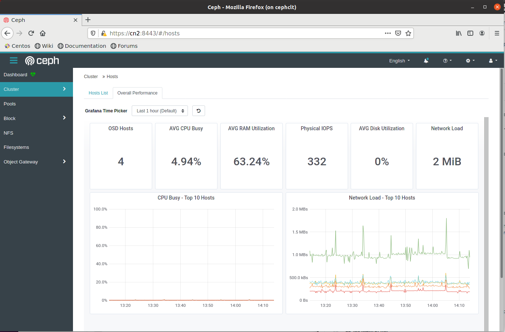

# Ceph Dashboard
Ceph Dashboard, fourni à partir de la version Luminous, une est d'abord une simple vue des diverses informations d’un cluster Ceph via une interface Web.
Cette interface est un module intégré au service mgr de Ceph.
A partir de la version Octopus, le dashboard permet de gèrer l'ensemble des fonctions d'un cluster Ceph.

## Acces au dashboard
Comme tous services dans Ceph, le dashboard est en mode haute disponibilité. voici une méthode pour connaitre l'url de connexion par défaut :
```
[ceph: root@cn1 /]# ceph mgr services
{
    "dashboard": "https://cn2:8443/",
    "prometheus": "http://cn2:9283/"
}
```
Via la commande ```ceph mgr services``` il est possible de reccupérer l'url du dashboard. 
## outils de métrologie
Grafana et Prometheus peuvent être installés à l'aide de cephadm. Ils seront automatiquement configurés par cephadm. vous retrouvez ensuite l'ensemble des métriques depuis le dashboard sans effort. Lorsque vous créé un cluster Ceph avec cephadmin et en activant la gestion des containers, Grafana et Prometheus sont installé et configuré par défaut et sont donc directement accessible ;)
## Acces au Dashboard depuis ce labs
Le Dashboard utilise les noms des hosts du labs, qui ne sont pas définit à l'extérieur du labs. Pour facilité sont acces, vous aller utiliser firefox depuis une session distante depuis la vm cephclt.
```
sg4r@work:~/dev/ceph-octopus$ vagrant ssh cephclt
Last login: Thu Jan 21 08:06:58 2021 from 192.168.121.1
[vagrant@cephclt ~]$ firefox https://cn1:8443/ &
[1] 3625
```
Vous allez être redirigé vers la page d'authentification du Dashboard. Utilisez le compte admin et votre mot de passe défini lors de la création du cluster, puis allez dans "Cluster", puis "Host", puis "Overall Performance" pour visualiser les métriques prédéfinis.


## Documentation
Pour plus d’information voir https://docs.ceph.com/en/latest/mgr/dashboard/
